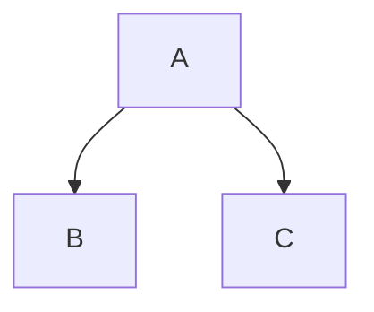

Learning Git and Github!
========================
Subheadline
-----------

***

Version **control** is an essential skill for _developers_ to master, and ~~Git~~ is by far the most popular version control system on the web. In this fast-paced course, author Ray Villalobos shows you how to install Git and use the fundamental commands you need to work with Git projects: moving files, managing logs, and working with branches.

>Plus, you'll [learn](https://www.linkedin.com/learning) how to work with the popular GitHub website to explore existing projects, clone them to your local hard drive, and use them as templates for your new projects.

This is a footnote[^1]. Another footnote[^2].

- [^1]: My reference
- [^2]: Another footnote

1. Item One
1. Item Two
    - Indented
    - Test
  
`test`

```python
x = 5
for i in range(0,x):
  print(i)
```
<details>
  <summary>collapsed</summary>
  
| Left | Center | Right |
| -----|:------:|-----: |
| One  |Two     |$1.00  |
| Two  |Four    |$120.00|

  Collapsed text
  
</details>


Task List
- [ ] Task one
- [x] Task two


> [!NOTE]
> BLAH





